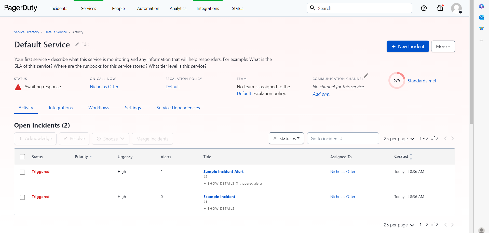
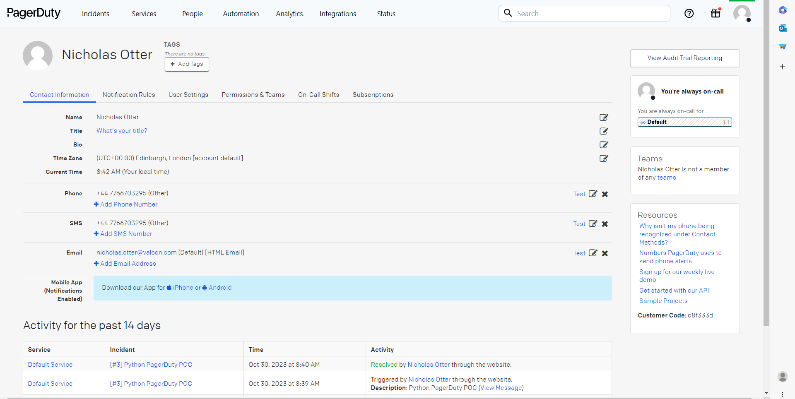

# python-pagerduty-poc

POC for integrating with the PagerDuty API through Python. 

## Run locally

1. Install dependencies:
`pip3 install requirements.txt`

2. Set environment variables:

3. Run main.py
`python3 main.py`

## PagerDuty requirements

1. Create PagerDuty Service

2. Create PagerDuty User with Phone Number and add to as On Call to that service

## PagerDuty page a Team via escalation policies for future reference

