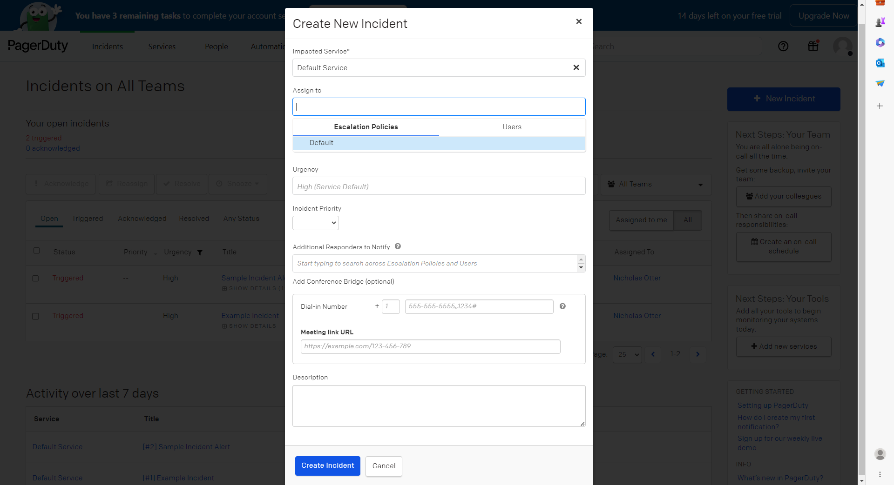

# python-pagerduty-poc

POC for integrating with the PagerDuty API through Python. 

Triggers PagerDuty "Service" "Incident" which phones the on-call PagerDuty "User".  

## Run locally

1. Install dependencies: 
`pip3 install requirements.txt`

2. Set environment variables: 
`PAGERDUTY_ROUTING_KEY`

4. Run main.py: 
`python3 main.py`

## PagerDuty requirements

1. Create PagerDuty "Service"
2. Create PagerDuty "User" with Phone Number and add to as "On Call" to "Service"
3. "Integrate" PagerDuty EventsAPIv2 with "Service" and get "Integration Key" / "Routing Key"

## PagerDuty page a Team via escalation policies for future reference

